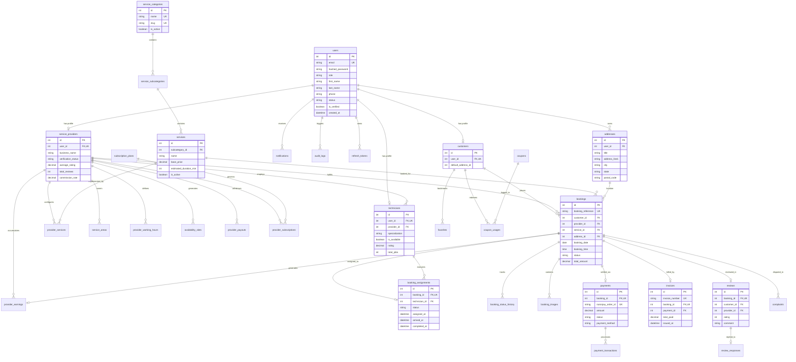

# HomeServe Technologies — Entity-Relationship (ER) Diagram

```mermaid
erDiagram
    users ||--o| customers : "has profile"
    users ||--o| service_providers : "has profile"
    users ||--o| technicians : "has profile"
    users ||--o{ addresses : "owns"
    users ||--o{ notifications : "receives"
    users ||--o{ audit_logs : "triggers"
    users ||--o{ refresh_tokens : "owns"

    service_providers ||--o{ technicians : "employs"
    service_providers ||--o{ provider_services : "configures"
    service_providers ||--o{ service_areas : "covers"
    service_providers ||--o{ provider_working_hours : "defines"
    service_providers ||--o{ availability_slots : "generates"
    service_providers ||--o{ provider_earnings : "accumulates"
    service_providers ||--o{ provider_payouts : "withdraws"
    service_providers ||--o{ provider_subscriptions : "enrolled_in"

    service_categories ||--o{ service_subcategories : "contains"
    service_subcategories ||--o{ services : "contains"
    services ||--o{ provider_services : "implemented_by"

    customers ||--o{ bookings : "places"
    customers ||--o{ favorites : "bookmarks"
    customers ||--o{ coupon_usages : "redeems"

    service_providers ||--o{ bookings : "fulfills"
    services ||--o{ bookings : "booked_for"
    addresses ||--o{ bookings : "location"

    bookings ||--o| booking_assignments : "assigned_to"
    technicians ||--o{ booking_assignments : "executes"

    bookings ||--o{ booking_status_history : "tracks"
    bookings ||--o{ booking_images : "contains"

    bookings ||--o| payments : "settled_via"
    payments ||--o{ payment_transactions : "processes"
    bookings ||--o| invoices : "billed_by"
    bookings ||--o| provider_earnings : "generates"

    bookings ||--o| reviews : "reviewed_in"
    reviews ||--o| review_responses : "replied_to"
    bookings ||--o{ complaints : "disputed_in"

    coupons ||--o{ coupon_usages : "logged_in"
    subscription_plans ||--o{ provider_subscriptions : "governs"

    users {
        int id PK
        string email UK
        string hashed_password
        string role
        string first_name
        string last_name
        string phone
        string status
        boolean is_verified
        datetime created_at
    }

    customers {
        int id PK
        int user_id FK,UK
        int default_address_id
    }

    service_providers {
        int id PK
        int user_id FK,UK
        string business_name
        string verification_status
        decimal average_rating
        int total_reviews
        decimal commission_rate
    }

    technicians {
        int id PK
        int user_id FK,UK
        int provider_id FK
        string specialization
        boolean is_available
        decimal rating
        int total_jobs
    }

    addresses {
        int id PK
        int user_id FK
        string title
        string address_line1
        string city
        string state
        string postal_code
    }

    service_categories {
        int id PK
        string name UK
        string slug UK
        boolean is_active
    }

    services {
        int id PK
        int subcategory_id FK
        string name
        decimal base_price
        int estimated_duration_min
        boolean is_active
    }

    bookings {
        int id PK
        string booking_reference UK
        int customer_id FK
        int provider_id FK
        int service_id FK
        int address_id FK
        date booking_date
        time booking_time
        string status
        decimal total_amount
    }

    booking_assignments {
        int id PK
        int booking_id FK,UK
        int technician_id FK
        string status
        datetime assigned_at
        datetime arrived_at
        datetime completed_at
    }

    payments {
        int id PK
        int booking_id FK,UK
        string razorpay_order_id UK
        decimal amount
        string status
        string payment_method
    }

    invoices {
        int id PK
        string invoice_number UK
        int booking_id FK,UK
        int payment_id FK
        decimal total_paid
        datetime issued_at
    }

    reviews {
        int id PK
        int booking_id FK,UK
        int customer_id FK
        int provider_id FK
        int rating
        string comment
    }
```
